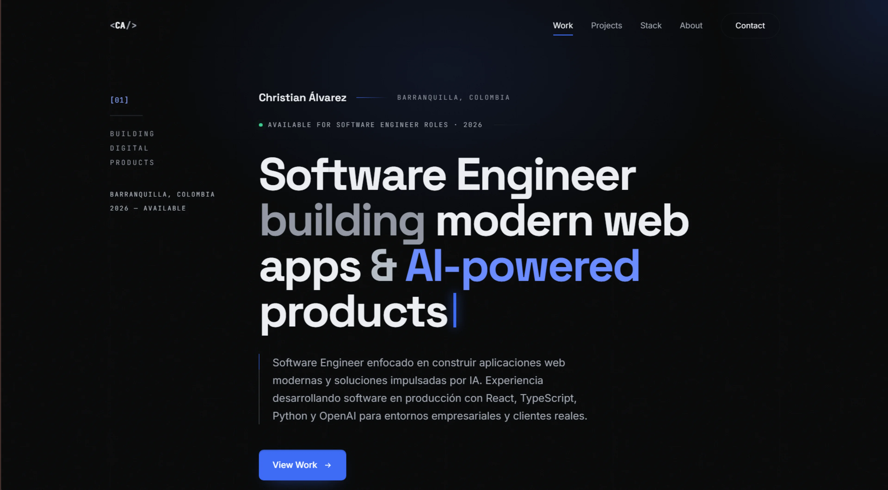
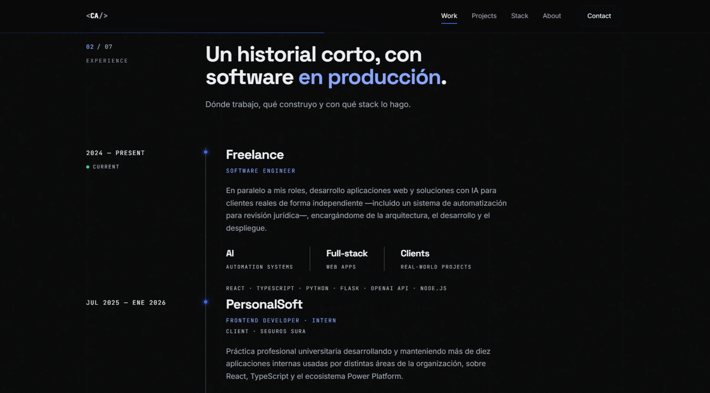
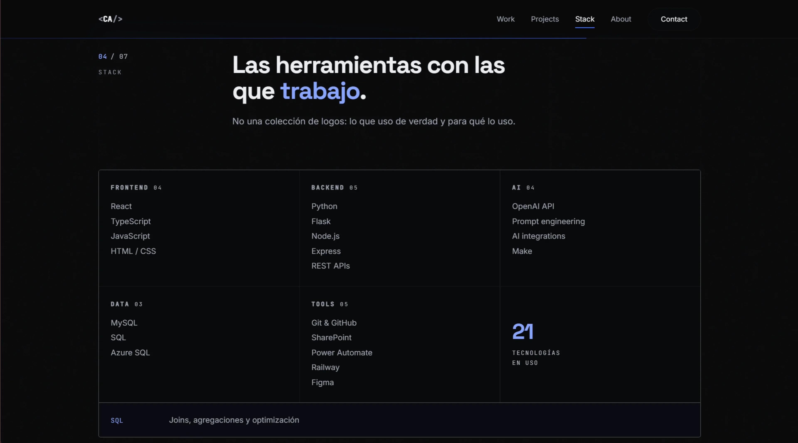
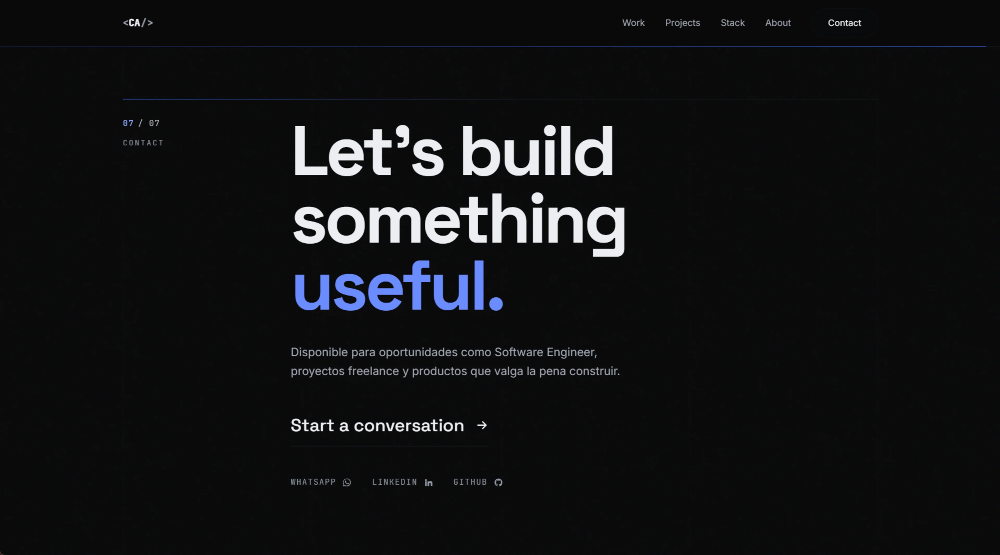

# Hi, I'm Christian Álvarez 👋

### Software Engineer — I build modern web apps & AI-powered products.

Personal portfolio built with **React + Vite + Framer Motion**. Editorial, dark, minimal and fully responsive.

🔗 **Live:** _add your URL here after deploying_ · `https://…vercel.app`
📍 Barranquilla, Colombia

---

## 🧭 A look inside

|  |  |
|:-:|:-:|
|  |  |
| **Home** — hero & engineering snapshot | **Experience** — editorial timeline |
|  |  |
| **Stack** — interactive readout panel | **Contact** — WhatsApp, LinkedIn, GitHub, email |

---

## 👨‍💻 About me

Systems engineer focused on **building software people actually use**. I move comfortably
between frontend and backend, enjoy solving real business problems, and today I combine
**modern web development with applied AI** for enterprise environments and real clients.
Currently freelancing and open to Software Engineer opportunities.

## 🛠️ Tech stack

**Frontend**


**Backend**


**Data & AI**


**Tools**


## 🚀 Featured projects

| Project | What it is | Tech | Links |
|---|---|---|---|
| **Forja Gym — Landing** | Single-page gym landing with 11 functional screens (bookings, payments, calculators). | React · Vite · Tailwind | [Live](https://forja-gym-landing.vercel.app/) · [Code](https://github.com/ChristianAB03/forja-gym-landing) |
| **ApparcaCUC** | Smart-parking platform: real-time availability, QR bookings, IoT simulation. | React · Express · MongoDB | [Live](https://apparcacuc.vercel.app/) · [Code](https://github.com/ChristianAB03/ApparcaCUC) |
| **Soledad Conecta** | Digital showcase for local entrepreneurs — 🏆 Hackathon Soledad 2026 winner. | React · Express · MySQL | [Live](https://soledadconecta.com/) |
| **AI Legal Review** | Automation system that pre-screens administrative acts with AI before signing. | Python · Flask · OpenAI | _Client project_ |

## 💻 Run locally

```bash
npm install
npm run dev      # http://localhost:5173
npm run build    # production build → /dist
```

All editable content lives in a single file: **`src/data/content.js`** (contact info,
snapshot, case studies, experience, projects, stack and the about text). Project images
go in `public/projects/` and are referenced by the `image` field; leaving it empty renders
a generated cover. Design tokens (colors, fonts) are at the top of `src/index.css`.

## 📫 Contact

- 💬 WhatsApp: [+57 304 549 1728](https://wa.me/573045491728)
- 💼 LinkedIn: [christianalvarez0316](https://linkedin.com/in/christianalvarez0316)
- 🐙 GitHub: [@ChristianAB03](https://github.com/ChristianAB03)
- ✉️ Email: [christian2003cab@gmail.com](mailto:christian2003cab@gmail.com)

---

<p align="center">© 2026 Christian Álvarez</p>
